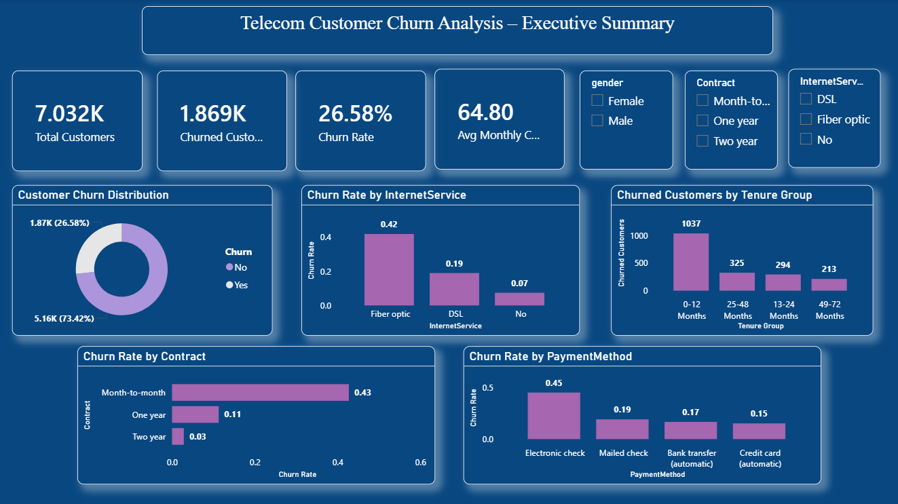

# Customer_Churn_Analysis
End-to-end churn analysis using Python, SQL, and Power BI

# Telecom Customer Churn Analysis — End-to-End

An end-to-end data analytics project analyzing customer churn for a telecom company, 
covering data cleaning, exploratory data analysis, and an interactive Power BI dashboard.

## Project Overview
Using a dataset of 7,032 telecom customers, this project identifies the key drivers 
behind customer churn and translates them into actionable business recommendations — 
from raw CSV to a decision-ready executive dashboard.

## Workflow
1. **Data Cleaning & Validation (SQL)** — checked for nulls, duplicates, blank strings, 
   and validated categorical fields (Churn, Contract) using MySQL
2. **Exploratory Data Analysis (Python)** — used Pandas, Matplotlib, and Seaborn to 
   explore distributions, outliers, and correlations
3. **Dashboard (Power BI)** — built an interactive executive summary dashboard with 
   KPI cards and slicers for gender, contract, and internet service type

## Key Findings
- **Overall churn rate: 26.58%** (1,869 of 7,032 customers churned)
- **Contract type is the strongest churn driver**: Month-to-month customers churn at 
  **42.71%**, versus 11.28% for one-year and just 2.85% for two-year contracts
- **Internet service matters**: Fiber optic customers churn at **41.89%**, nearly 
  double DSL customers (19.00%)
- **Payment method matters**: Electronic check users churn at **45.29%**, the highest 
  of any payment method, versus ~15% for automatic credit card payments
- **Tenure gap**: Churned customers average **17.98 months** tenure vs **37.65 months** 
  for retained customers — most churn happens in the first 12 months (1,037 of all 
  churned customers fall in the 0–12 month tenure group)
- **Highest-risk segment**: Month-to-month contract + Fiber optic customers churn at 
  **54.61%** — the single most at-risk group in the dataset

## Business Recommendation
Prioritize retention offers — such as discounted contract upgrades — specifically at 
month-to-month, fiber-optic customers within their first 12 months, since this segment 
shows the highest combined churn risk.

## Tools Used
- **SQL (MySQL)** — data cleaning, validation, and business-question queries
- **Python** — Pandas, NumPy, Matplotlib, Seaborn for EDA
- **Power BI** — interactive executive dashboard

## Files in this Repository
| File | Description |
|---|---|
| `churn_analysis.sql` | SQL queries for data cleaning, validation, and churn analysis |
| `churn_eda.ipynb` | Python notebook with EDA, distributions, and correlation analysis |
| `customer_churn_cleaned.csv` | Cleaned dataset used for analysis |
| `dashboard_screenshot.png` | Power BI executive summary dashboard |

## Dashboard Preview

## Dataset
Telecom customer churn dataset (7,032 records, 21 features) including demographics, 
account information (tenure, contract, charges), and service subscriptions.
